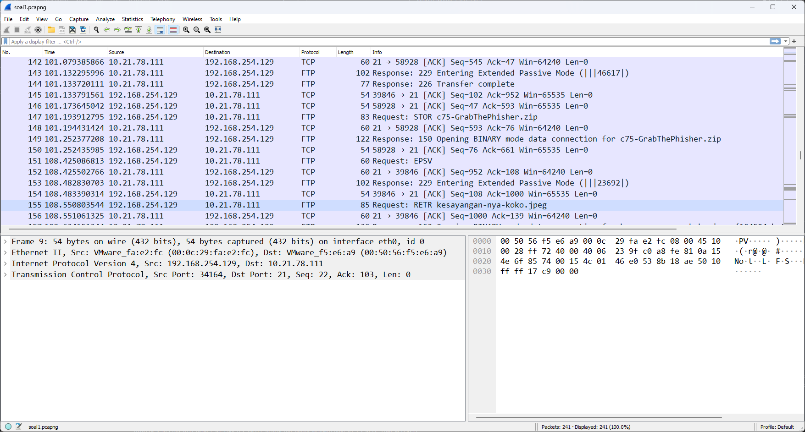

# Jarkom-Modul-1-B17-2023

## Soal 1
User melakukan berbagai aktivitas dengan menggunakan protokol FTP. Salah satunya adalah mengunggah suatu file.

a. Berapakah sequence number (raw) pada packet yang menunjukkan aktivitas tersebut?

b. Berapakah acknowledge number (raw) pada packet yang menunjukkan aktivitas tersebut? 

c. Berapakah sequence number (raw) pada packet yang menunjukkan response dari aktivitas tersebut?

d. Berapakah acknowledge number (raw) pada packet yang menunjukkan response dari aktivitas tersebut?

### Solusi

Pada persoalan dijelaskan bahwa user melakukan salah satu aktivitas yaitu menggungah suatu file sehingga pada info dari package yang kita cari akan mengandung STOR yang berarti menggungah sehingga pada file tersebut bisa dilihat bahwa package nomor 147 melakukan STOR GrabThePhisher.zip dan untuk mengetahui package yang merupakan respon dari aktivitas 147 dapat dilihat bahwa pada package nomor 149 melakukan response terhadap package nomor 147 yaitu pada info Opening BINARY node data connection for c75-GrabThePhiser.zip. Sehingga untuk menjawab pertanya package 147 dan package 149 dapat dibuka dan dilihat 

Sehingga untuk jawaban : 
- 1.a 258040667
- 1.b 1044861039
- 1.c 1044861039
- 1.d 258040696

## Soal 2
#### Sebutkan web server yang digunakan pada portal praktikum Jaringan Komputer!

Pertama kita lakukan filtering terlebih dahulu untuk mencari "Jaringan Komputer" dengan menggunakan ``frame contains "Jaringan Komputer" `` sehingga akan terlihat 1 package, lalu pada package tersebut kita lakukan `Follow - TCP Stream ` sehingga akan terlihat web server yang digunakan pada portal praktikum Jaringan Komputer

Sehingga dapat dilihat bahwa Web Server yang digunakan adalah : `Gunicorn `

### Jawaban : `gunicorn `
## Soal 3
### Dapin sedang belajar analisis jaringan. Bantulah Dapin untuk mengerjakan soal berikut:
 - Berapa banyak paket yang tercapture dengan IP source maupun destination address adalah 239.255.255.250 dengan port 3702?
 - Protokol layer transport apa yang digunakan?

## Soal 4

## Soal 5
Elshe menemukan suatu file packet capture yang menarik. Bantulah Elshe untuk menganalisis file packet capture tersebut.

#### a. Berapa banyak packet yang berhasil di capture dari file pcap tersebut?
Jawaban: 60
Saat membuka file PCAP terdapat 60 paket didalamnya 
#### b. Port berapakah pada server yang digunakan untuk service SMTP?
Jawaban: 25
Dalam paket dengan protokol SMTP, paket menggunakan port 25
#### c. Dari semua alamat IP yang tercapture, IP berapakah yang merupakan public IP?
Jawaban: 74.53.140.153

#### Langkah untuk menemukan jawaban:
Langkah pertama kita harus mencari password yang dibutuhkan. Dalam file PCAP saya memfilter dengan clue "Pass", maka akan muncul di paket nomor 14. Di dalam TCP, terdapat password yang harus didecode, yaitu “NWltcGxlUGFzNXdvcmQ=” dan menjadi “5implePas5word”. Saat file zip dibuka, masukkan password tersebut. File ini digunakan untuk menampilkan soal di dalam terminal.

Password awal di paket nomor 14

TCP Paket 14 untuk melihat jawaban

Jawaban pada terminal

## Soal 6
Seorang anak bernama Udin Berteman dengan SlameT yang merupakan seorang penggemar film detektif. sebagai teman yang baik, Ia selalu mengajak slamet untuk bermain valoranT bersama. suatu malam, terjadi sebuah hal yang tak terdUga. ketika udin mereka membuka game tersebut, laptop udin menunjukkan sebuah field text dan Sebuah kode Invalid bertuliskan "server SOURCE ADDRESS 7812 is invalid". ketika ditelusuri di google, hasil pencarian hanya menampilkan a1 e5 u21. jiwa detektif slamet pun bergejolak. bantulah udin dan slamet untuk menemukan solusi kode error tersebut.

Jawaban: JDRNJA
#### Langkah untuk menemukan jawaban:
Terdapat beberapa clue dalam soal. Pertama "server SOURCE ADDRESS 7812 is invalid". Hal ini menandakan arti error terdapat pada IP Source paket nomor 7812. Selain itu, kalimat "menampilkan a1 e5 u21" dapat diartikan sebagai clue untuk mengubah setiap digit IP menjadi alpabhet. 104.18.14.101 = 10 4 18 14 10 1 = J D R N J A

IP source pada paket nomor 7812

## Soal 7
Berapa jumlah packet yang menuju IP 184.87.193.88?

Jawaban: 6
#### Langkah untuk menemukan jawaban:
Pada Display Filter masukan syntax ip.dst == 184.87.193.88, maka akan muncul 6 buah yang memiliki destination IP berikut. IP dst berarti kita memfilter paket yang menuju ke alamat tersebut

Terdapat 6 Paket pada alamat tersebut

## Soal 8
Berikan kueri filter sehingga wireshark hanya mengambil semua protokol paket yang menuju port 80! (Jika terdapat lebih dari 1 port, maka urutkan sesuai dengan abjad)

Jawaban: tcp.dstport == 80 || udp.dstport == 80
#### Langkah untuk menemukan jawaban:
pada display filter masukan syntax tcp.dstport == 80 || udp.dstport == 80, maka akan menunjukan bahwa Syntax berhasil. tcp dan udp menandakan jenis protokol yang digunakan. tanda || menandakan “atau”. sehingga kueri akan menampilkan seluruh jenis protokol yang menuju port 80

Kueri untuk menampilkan paket pada port tersebut

## Soal 9
Berikan kueri filter sehingga wireshark hanya mengambil paket yang berasal dari alamat 10.51.40.1 tetapi tidak menuju ke alamat 10.39.55.34!

Jawaban: ip.src == 10.51.40.1 && ip.dst != 10.39.55.34
#### Langkah untuk menemukan jawaban:
Pada Display Filter, untuk menyelesaikan soal tersebut digunakan syntax di atas. Namun, pada source dan destination dengan IP tersebut, tidak ditemukan alamat yang sesuai.

Kueri untuk menampilkan paket pada alamat tersebut

## Soal 10
